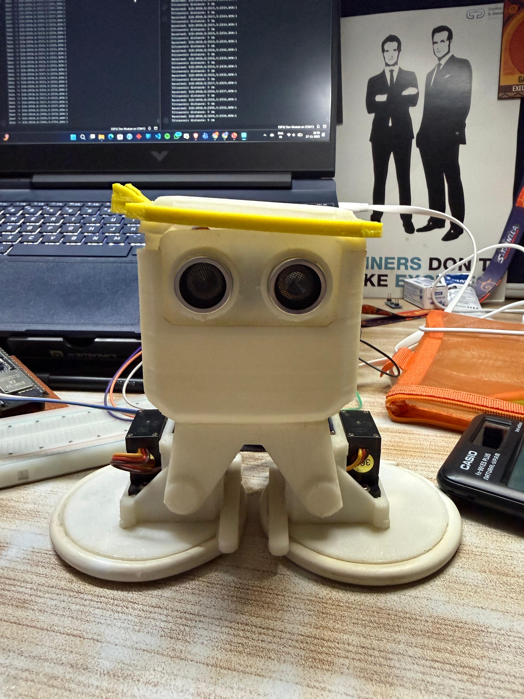
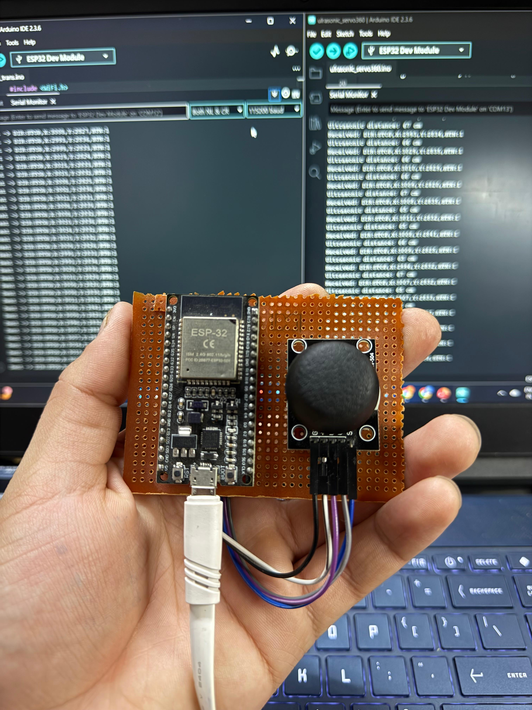

# 🤖 ESP32-OTTO-ROBOT

> **A wireless Otto Ninja robot controlled by an analog joystick using dual ESP32 boards, Wi-Fi/UDP communication, differential servo drive, and ultrasonic obstacle protection.**

<p align="center">


</p>

---

## 📌 Overview

**ESP32-OTTO-ROBOT** is a wireless robotic system built around **two ESP32
development boards** and a 3D-printed **Otto Ninja** platform.

The robot is currently controlled using an **analog joystick**. A dedicated
ESP32 acts as the transmitter, reading the joystick position and converting
it into movement commands. These commands are sent wirelessly to a second
ESP32 through **Wi-Fi using UDP**.

The receiver ESP32 is mounted on the robot and controls two
**continuous-rotation servo motors** using differential drive. An
**HC-SR04 ultrasonic sensor** provides forward obstacle detection and stops
the robot when an obstacle is detected within the configured safety
threshold.

> **Current implementation:** Analog joystick control only. EEG/EMG-based
> control is not part of the current hardware or firmware.

---

## ✨ Features

- 🎮 Analog joystick-based control
- 📡 Wireless ESP32-to-ESP32 communication
- ⚡ UDP-based command transmission
- 🚗 Forward and backward movement
- ↩️ Left and right turning
- 🛑 Stop control
- 📏 HC-SR04 ultrasonic obstacle detection
- 🖨️ 3D-printed Otto Ninja platform
- 🔧 Separate transmitter and receiver firmware
- 💻 Arduino-compatible ESP32 firmware

---

## 🧠 System Architecture

```text
                    🎮 ANALOG JOYSTICK
                           │
                     VRx / VRy / SW
                           │
                           ▼
                ┌─────────────────────┐
                │   ESP32 TRANSMITTER │
                │                     │
                │  Read Joystick      │
                │  Direction Logic    │
                │  UDP Transmission   │
                └──────────┬──────────┘
                           │
                       Wi-Fi / UDP
                        Port 4210
                           │
                           ▼
                ┌─────────────────────┐
                │    ESP32 RECEIVER   │
                │                     │
                │  UDP Reception      │
                │  Motor Control      │
                │  Obstacle Check     │
                └───────┬───────┬─────┘
                        │       │
                        ▼       ▼
                   LEFT SERVO  RIGHT SERVO
                        │       │
                        └───┬───┘
                            ▼
                     🤖 OTTO NINJA
                         ROBOT
                            ▲
                            │
                         HC-SR04
                    Obstacle Detection
```

---

## 🎮 Control Mapping

The analog joystick provides the movement input for the robot.

| Joystick Input | Robot Action |
|---|---|
| ⬆️ Up | Forward |
| ⬇️ Down | Backward |
| ⬅️ Left | Turn Left |
| ➡️ Right | Turn Right |
| 🎯 Center | Stop |

The transmitter uses calibrated joystick center values and a dead zone to
prevent small analog fluctuations from causing unwanted movement.

### Current Calibration

```text
Center X  : 3010
Center Y  : 2840
Dead Zone : 200
```

---

## 📡 Wireless Communication

The transmitter ESP32 creates a Wi-Fi access point and the receiver ESP32
connects to it.

```text
SSID      : ESP_BUGGY
Password  : 12345678
UDP Port  : 4210
```

The transmitter sends the joystick-derived direction to the receiver using
UDP packets.

### Example Command

```text
DIR:FORWARD,X:2500,Y:1200,BTN:1
```

The receiver extracts the `DIR` field and maps it to the corresponding
servo movement.

---

## ⚙️ Differential Drive

The robot uses two continuous-rotation servo motors for differential drive.

Each servo controls one side of the robot.

| Movement | Left Servo | Right Servo |
|---|---:|---:|
| Forward | 0 | 180 |
| Backward | 180 | 0 |
| Left | 0 | 0 |
| Right | 180 | 180 |
| Stop | 90 | 90 |

These values correspond to the current physical orientation and working
configuration of the two servos.

---

## 🚧 Ultrasonic Obstacle Protection

An **HC-SR04 ultrasonic sensor** is mounted at the front of the Otto Ninja
robot.

The current forward obstacle threshold is:

```text
15 cm
```

When a `FORWARD` command is received:

```text
              HC-SR04
                  │
                  ▼
          Measure Distance
                  │
                  ▼
          Distance ≤ 15 cm?
             /          \
           YES           NO
            │             │
            ▼             ▼
       STOP SERVOS      FORWARD
```

The current obstacle protection blocks **forward movement** when an obstacle
is detected within 15 cm.

---


## 📷 Hardware

### Otto Ninja Robot

The receiver ESP32, servo motors, and ultrasonic sensor are integrated with
the 3D-printed Otto Ninja platform.




### Transmitter

The transmitter consists of an ESP32 and an analog joystick mounted on a
prototype/perfboard.



---

## 📍 Pin Configuration

### Transmitter ESP32

| Component | GPIO | Function |
|---|---:|---|
| Joystick VRx | GPIO 34 | X-axis analog input |
| Joystick VRy | GPIO 35 | Y-axis analog input |
| Joystick SW | GPIO 32 | Push-button input |

### Receiver ESP32

| Component | GPIO | Function |
|---|---:|---|
| Left Servo Signal | GPIO 13 | Left servo control |
| Right Servo Signal | GPIO 12 | Right servo control |
| HC-SR04 TRIG | GPIO 26 | Ultrasonic trigger |
| HC-SR04 ECHO | GPIO 25 | Ultrasonic echo |

For complete hardware information, see:

- [`hardware/components.md`](hardware/components.md)
- [`hardware/pinout.md`](hardware/pinout.md)
- [`hardware/wiring.md`](hardware/wiring.md)

---

## 💻 Firmware

The firmware is divided into two independent programs.

### Transmitter

```text
firmware/transmitter/joystick_transmitter.ino
```

The transmitter firmware:

- Reads joystick X/Y values
- Applies calibration
- Applies the dead zone
- Determines the movement direction
- Builds the UDP message
- Sends the command wirelessly

### Receiver

```text
firmware/receiver/buggy_receiver.ino
```

The receiver firmware:

- Connects to the transmitter Wi-Fi network
- Receives UDP packets
- Extracts the movement command
- Controls the left and right servos
- Measures ultrasonic distance
- Prevents forward movement when an obstacle is too close

---

## 🖨️ 3D-Printed Otto Ninja Platform

The robot is built using the **Otto Ninja** 3D-printed mechanical platform.

The available STL files are organized under:

```text
3d-models/otto-ninja/
```

The folder contains the available mechanical parts required for the
platform assembly, including body, head, legs, foot/wheel components,
plates, lid, and ultrasonic sensor mounting parts.

---

## 📂 Repository Structure

```text
ESP32-OTTO-ROBOT/
│
├── 3d-models/
│   └── otto-ninja/
│       ├── Otto DIY_Ninja_BAND...
│       ├── Otto DIY_Ninja_Foot...
│       ├── Otto DIY_Ninja_Head...
│       ├── Otto DIY_Ninja_INNERPLATE...
│       ├── Otto DIY_Ninja_LEGS...
│       ├── Otto DIY_Ninja_LID.stl
│       ├── Otto DIY_Ninja_Leg Left...
│       ├── Otto DIY_Ninja_Leg Right...
│       └── Otto DIY_Ninja_PLATE...
│
├── firmware/
│   ├── receiver/
│   │   └── buggy_receiver.ino
│   │
│   └── transmitter/
│       └── joystick_transmitter.ino
│
├── hardware/
│   ├── components.md
│   ├── pinout.md
│   └── wiring.md
│
├── images/
│   ├── otto-robot.jpeg
│   └── transmitter.jpeg
│
└── README.md
```

---

## 🛠️ Setup

### 1. Upload the Transmitter Firmware

Open:

```text
firmware/transmitter/joystick_transmitter.ino
```

Select the appropriate ESP32 board in Arduino IDE and upload the firmware to
the transmitter ESP32.

The transmitter creates the Wi-Fi access point:

```text
SSID      : ESP_BUGGY
Password  : 12345678
```

---

### 2. Upload the Receiver Firmware

Open:

```text
firmware/receiver/buggy_receiver.ino
```

Upload it to the receiver ESP32.

The receiver connects to the transmitter's Wi-Fi network and listens for
UDP packets on port `4210`.

---

### 3. Connect the Hardware

Connect the joystick, servo motors, and HC-SR04 according to the hardware
documentation:

```text
hardware/
├── components.md
├── pinout.md
└── wiring.md
```

---

### 4. Power the System

Power the transmitter and receiver.

Once both ESP32 boards are connected, move the joystick to control the
Otto Ninja robot.

---

## 🔌 Power & Wiring Notes

- Do **not** power servo motors directly from ESP32 GPIO pins.
- Use a suitable external power supply for the servo motors.
- Connect the ESP32 ground and servo power-supply ground together.
- If using a 5 V HC-SR04, do not connect its ECHO output directly to the
  ESP32 GPIO.
- Use an appropriate voltage divider or level shifter for the HC-SR04 ECHO
  signal.
- Verify servo direction with the robot lifted from the ground before
  testing movement.
- Ensure the external power supply can provide sufficient current for both
  servo motors.

---

## 🔄 Current Working Flow

```text
🎮 Joystick
     │
     ▼
ESP32 Transmitter
     │
     │ Wi-Fi / UDP
     ▼
ESP32 Receiver
     │
     ├───────────────┐
     │               │
     ▼               ▼
Servo Control     HC-SR04
     │          Obstacle Check
     │               │
     └───────┬───────┘
             ▼
       🤖 Otto Robot
```

---

## 🚀 Future Scope

The current implementation uses an **analog joystick** as the control
interface.

Possible future improvements include:

- [ ] Improved obstacle avoidance
- [ ] Real-time telemetry
- [ ] Battery monitoring
- [ ] Additional sensors
- [ ] Improved motion control
- [ ] Alternative human-machine interfaces
- [ ] Experimental EEG/EMG-based control

> EEG/EMG control is a possible future development and is **not part of the
> current implementation**.

---

## 📊 Project Status

**Current Status: Working Prototype ✅**

The current prototype demonstrates:

```text
Analog Joystick
      ↓
ESP32 Transmitter
      ↓
Wi-Fi / UDP
      ↓
ESP32 Receiver
      ↓
Dual Servo Drive
      ↓
Otto Ninja Robot
```

with forward ultrasonic obstacle protection.

---

<p align="center">

**ESP32 • Arduino • Wi-Fi • UDP • Joystick Control • Servo Drive • Ultrasonic Sensing**

</p>
